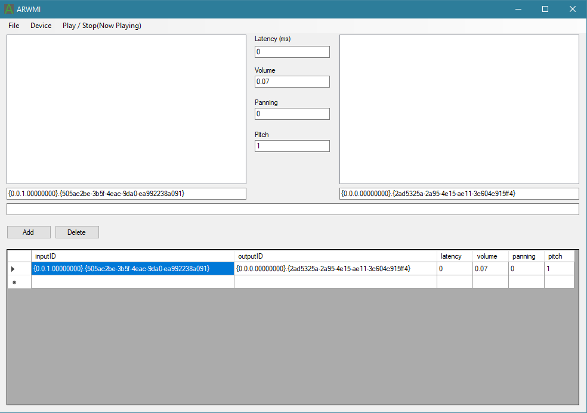

# ARWMIO
Audio Repeater With Multiple Inputs And Outputs using NAudio

## Download
You can download ARWMIO.zip with all binaries from "Releases" section to the right.
Or download all files from "ARWMIO/ARWMIO/bin/Debug" (debug version that may be broken).

## Example

### How to use
  1. Click Device -> WASAPI to display all inputs and outputs.
  2. Click "Add" to add line with current input, output and other parameters.
  3. Press F12 or "Play / Stop" to start playing sound from input to output.
